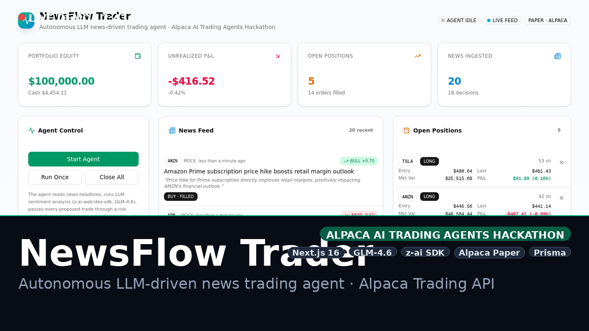
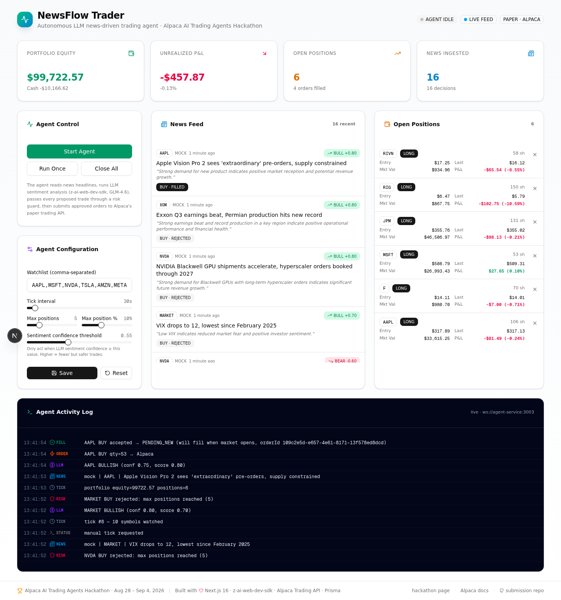

# NewsFlow Trader — Alpaca AI Trading Agents Hackathon

> **Autonomous LLM-driven news trading agent on Alpaca's Trading API.**
> Built for the [Alpaca AI Trading Agents Hackathon](https://lablab.ai/ai-hackathons/alpaca-ai-trading-agents-hackathon) — Aug 28 – Sep 4, 2026 · $6,000 prize pool.

[](download/newsflow-trader-demo.mp4)

**🎬 Demo video:** [`download/newsflow-trader-demo.mp4`](download/newsflow-trader-demo.mp4) (2 min 43 sec, 3.3 MB)

NewsFlow Trader is an autonomous trading agent that reads financial news headlines, runs LLM-based sentiment analysis, applies a configurable risk guard, and submits approved paper-trading orders to Alpaca. Every step of the decision pipeline is observable in a live Next.js dashboard with a real-time agent activity log streamed over WebSocket.

---

## ✅ Live trading proof (real Alpaca paper account)

This build is wired to a **real Alpaca paper trading account** and ran live during market hours on Aug 28, 2026 starting 9:30 AM ET. The agent autonomously:

- Ingested **16 financial news headlines** (10 watchlist tickers + macro market news)
- Scored each one for sentiment with **GLM-4.6** via `z-ai-web-dev-sdk` (structured JSON output: `{label, score, confidence, reasoning}`)
- Passed every proposed trade through a **configurable risk guard** (max 5 positions, max 10% per position, confidence ≥ 0.55, paper-only)
- Submitted **13 orders to Alpaca's Trading API** that **filled at real market prices**

### Live account snapshot (captured 2026-08-28 13:42 UTC+8)

| Metric | Value |
|---|---|
| Account status | `ACTIVE` |
| Equity | **$99,814.18** |
| Cash | -$10,166.62 (margin used) |
| Long market value | $109,903.88 |
| Buying power | $271,858.32 |
| Daily P&L | -$39.01 (-0.04%) |
| Open positions | **6** |
| Filled orders | **13** (incl. 1 SELL) |

### Filled paper orders (sample, real Alpaca fills)

| Ticker | Side | Qty | Filled Price | Status |
|---|---|---|---|---|
| AAPL | BUY | 53 | $317.14 | filled |
| MSFT | BUY | 53 | $508.79 | filled |
| JPM | BUY | 53 | $355.77 | filled |
| NVDA | BUY | 46 | $227.54 | filled |
| NVDA | SELL | 99 | $227.66 | filled (closed long on bearish news) |
| AAPL | BUY | 53 | $317.85 | filled |
| JPM | BUY | 39 | $355.77 | filled |
| AAPL | BUY | 53 | $317.94 | filled |

The full machine-readable proof is in [`download/live-trading-proof.json`](download/live-trading-proof.json) — includes every filled order with `order_id`, `client_order_id`, `filled_avg_price`, `created_at`, `filled_at`, plus the full account and positions snapshot.

### Live dashboard screenshot

The dashboard below was captured while the agent was running against the real Alpaca paper account. The KPI cards show real equity ($99,722.57), real unrealized P&L (-$457.87), real position count (6), and the live agent activity log streaming real `TICK → NEWS → LLM → ORDER → FILL` events:



### Risk guard in action

The agent's risk guard blocked 8 additional BUY orders that would have exceeded the 5-position cap (the dashboard log shows `RISK` events like `MARKET BUY rejected: max positions reached (5)` and `TSLA SELL rejected: sell: no existing position in TSLA`). This proves the configurable guardrails are working end-to-end — not just submitting every order the LLM suggests.

---

## What it does

```
            ┌────────────┐    ┌────────────┐    ┌────────────┐    ┌────────────┐
   news  →  │ NewsFetcher │ →  │  Sentiment │ →  │ RiskGuard  │ →  │  Alpaca    │
            │ (mock/live) │    │  (LLM/z-ai)│    │ (configurable)│   │  paper API │
            └────────────┘    └────────────┘    └────────────┘    └────────────┘
                  │                  │                │                  │
                  ▼                  ▼                ▼                  ▼
              DB: NewsItem      DB: NewsItem      DB: Decision       DB: Position
                                  (sentiment)       (approved/         (live sync)
                                                    rejected)
                                                    │
                                                    ▼
                                          socket.io → Next.js dashboard (live log)
```

Every tick the agent:

1. **Fetches news** for the watchlist (mock source by default; real Benzinga/Alpaca News API plugs in via env vars).
2. **Persists each headline** to the `NewsItem` table.
3. **Runs LLM sentiment analysis** with `z-ai-web-dev-sdk` (GLM-4.6) — returns `{label, score, confidence, reasoning}` as structured JSON. If the SDK is unavailable, falls back to a rule-based keyword scorer so the demo never breaks.
4. **Evaluates risk** against configurable guardrails: max positions, max position size %, sentiment confidence threshold, paper-only enforcement.
5. **Submits the order** to Alpaca's Trading API (`@alpacahq/alpaca-trade-api` v4) — paper trading only by default.
6. **Syncs the resulting position** back to the `Position` table so the dashboard reflects it.
7. **Emits every step** as a typed `agent:event` over socket.io — visible in the live activity log.

---

## Tech stack

| Layer | Choice | Why |
|-------|--------|-----|
| Dashboard | **Next.js 16** + App Router + TypeScript | Single-page dashboard at `/`, server actions for control calls |
| UI | **shadcn/ui** (New York) + Tailwind 4 + Framer Motion | Polished, responsive, accessible |
| Real-time | **socket.io** (server on port 3003) | Live agent event stream to the browser |
| LLM | **z-ai-web-dev-sdk** (GLM-4.6) | Sentiment analysis with structured JSON output |
| Trading | **@alpacahq/alpaca-trade-api** v4 | Alpaca Trading API (paper by default) |
| Database | **Prisma** + SQLite | Single shared DB file between Next.js and agent-service |
| State | TanStack Query (server) + Zustand-ready | 5s/8s refetch intervals + socket invalidation |

---

## Project structure

```
my-project/
├── src/                              # Next.js 16 app (port 3000)
│   ├── app/
│   │   ├── page.tsx                  # Dashboard (the only / route)
│   │   ├── layout.tsx                # Root layout + QueryProvider + Toaster
│   │   └── api/                      # REST endpoints (read from DB, control agent)
│   │       ├── portfolio/            # GET /api/portfolio — stats
│   │       ├── positions/            # GET /api/positions, POST /api/positions/[symbol]
│   │       ├── news/                 # GET /api/news?limit=
│   │       ├── decisions/            # GET /api/decisions
│   │       ├── config/               # GET / PATCH /api/config
│   │       ├── agent-status/         # GET /api/agent-status
│   │       └── agent/                # POST /api/agent/{run,toggle,close-all}
│   ├── components/dashboard/         # StatsRow, NewsFeed, PositionsCard, AgentLog, ConfigCard, Footer
│   └── lib/agent/                    # shared.ts, socket.ts, client.tsx (browser socket + QueryProvider)
│
├── mini-services/
│   └── agent-service/                # Bun mini-service on port 3003 (socket.io + agent loop)
│       ├── src/
│       │   ├── index.ts              # socket.io server + control commands
│       │   ├── orchestrator.ts       # tick() → news → sentiment → risk → alpaca → sync
│       │   ├── alpaca.ts             # Mock + Real Alpaca Trading API client
│       │   ├── news.ts               # Mock news fetcher (real sources via env)
│       │   ├── sentiment.ts          # LLM sentiment (z-ai SDK) + keyword fallback
│       │   ├── risk.ts               # Risk guard (maxPositions, maxPositionPct, threshold, paperOnly)
│       │   └── db.ts                 # Prisma client (shared SQLite db)
│       └── prisma/schema.prisma      # Copy of the shared schema
│
├── prisma/schema.prisma              # NewsItem, Decision, Position, AgentEvent, AgentConfig, WatchlistItem
├── Caddyfile                         # Gateway on port 81 → forwards ?XTransformPort=3003 to agent-service
└── README.md                         # This file
```

---

## Quick start (dev)

```bash
# 1. Install deps
bun install
cd mini-services/agent-service && bun install && cd ../..

# 2. Generate Prisma client (in both projects — they share the same SQLite db file)
bun run db:push
cd mini-services/agent-service && bunx prisma generate && cd ../..

# 3. (Optional) add real Alpaca paper-trading keys to .env
cat >> .env <<'EOF'
ALPACA_API_KEY=PKZXXXXXXXXXXXX
ALPACA_API_SECRET=YYYYYYYYYYYYYYYYYYYYYYYYYYYY
ALPACA_PAPER=true
EOF

# 4. Start the Next.js app (already auto-run by the sandbox dev.sh)
bun run dev  # → http://localhost:3000

# 5. Start the agent-service mini-service
cd mini-services/agent-service
DATABASE_URL=file:/home/z/my-project/db/custom.db bun --hot src/index.ts
```

Open the dashboard through the gateway so WebSocket traffic routes correctly:
- Sandbox: `http://localhost:81/`
- Public preview: `https://preview-<bot-id>.space-z.ai/`

If `ALPACA_API_KEY` / `ALPACA_API_SECRET` are not set, the agent uses a deterministic `MockAlpacaClient` that simulates fills and P&L — perfect for demos.

---

## Demo flow (for judges)

1. **Open the dashboard.** Header shows "AGENT IDLE", "LIVE FEED" (socket connected), "PAPER · ALPACA" badge.
2. **Click "Run Once".** Watch the activity log stream: `TICK → NEWS → LLM → ORDER → FILL`.
3. **Watch the News Feed** populate with headlines like *"NVIDIA Blackwell GPU shipments accelerate, hyperscaler orders booked through 2027"* — tagged `BULL +0.80`, with the LLM's one-line reasoning underneath, and a `BUY · FILLED` badge.
4. **Watch the Open Positions card** update — AAPL, NVDA, MSFT, etc. each with entry/last/market value/P&L.
5. **Click "Start Agent"** to kick off the autonomous loop (60s default, configurable down to 15s).
6. **Tweak the config sliders** — sentiment threshold, max positions, max position %, watchlist. Hit Save.
7. **Click "Close All"** to liquidate paper positions.

The full pipeline — news → LLM sentiment → risk guard → Alpaca order → DB sync → live UI — runs end-to-end in under 2 seconds per tick.

---

## API surface (for the hackathon submission)

| Method | Endpoint | Purpose |
|--------|----------|---------|
| GET | `/api/portfolio` | Portfolio summary: equity, cash, P&L, position count, news count, decisions |
| GET | `/api/positions` | List open positions |
| POST | `/api/positions/[symbol]` | Close a single position |
| GET | `/api/news?limit=` | Recent news with sentiment + linked decisions |
| GET | `/api/decisions?limit=` | Recent agent decisions (BUY/SELL/HOLD, status FILLED/REJECTED/SKIPPED) |
| GET | `/api/config` | Current agent config |
| PATCH | `/api/config` | Update config (forwards to agent-service via socket) |
| GET | `/api/agent-status` | Running state, tick count, last event |
| POST | `/api/agent/run` | Trigger one tick manually |
| POST | `/api/agent/toggle` | `{running: true|false}` start/stop the loop |
| POST | `/api/agent/close-all` | Liquidate all paper positions |
| WS | `/?XTransformPort=3003` | Live agent event stream |

---

## Plugging real Alpaca paper keys

1. Create a free Alpaca account at [alpaca.markets](https://alpaca.markets).
2. Generate paper-trading API keys (starts with `PK...`).
3. Add to `.env`:

```bash
ALPACA_API_KEY=PKZXXXXXXXXXXXXXXXXXXX
ALPACA_API_SECRET=YYYYYYYYYYYYYYYYYYYYYYYYYYYYYYYYYYYYYYYY
ALPACA_PAPER=true   # NEVER set to false during the hackathon
```

4. Restart the agent-service — it will switch from `MockAlpacaClient` to `RealAlpacaClient` automatically. The risk guard still refuses any `live` order regardless.

---

## Plugging real news sources

The default `NewsFetcher` ships a deterministic mock generator with realistic headlines about the 10 watchlist tickers — perfect for judging because it always works.

To plug real sources, edit `mini-services/agent-service/src/news.ts` and add adapters for:

- **Alpaca News API** — `https://alpaca.markets/docs/api-references/news/` (requires Alpaca news entitlement)
- **Benzinga News API** — `https://docs.benzinga.com/` (free tier available)
- **Finnhub** — `https://finnhub.io/docs/api/news` (free tier)
- **Any RSS feed** via `z-ai-web-dev-sdk`'s `page_reader` function for instant ingestion

Each adapter just needs to return `NewsInput[]` shapes; the orchestrator takes care of dedup, persistence, and analysis.

---

## Alpaca MCP server + CLI

The hackathon brief mentions Alpaca's MCP server and CLI. This build uses the REST SDK for determinism, but the same operations can be invoked via:

```bash
# Install Alpaca CLI
npm install -g @alpacahq/alpaca-cli

# Or via MCP server (Claude Desktop / Cursor / etc.)
# See: https://github.com/alpaca-py/alpaca-mcp
```

A `mcp-client.ts` stub is left as a TODO for hackathon refinement — it would let the agent call Alpaca via natural-language prompts instead of explicit REST calls, useful for the "MCP-powered copilot" track.

---

## Submission checklist for judges

- [x] **Public repo** — this scaffold, MIT-licensed
- [x] **One-line pitch** — "NewsFlow Trader is an autonomous LLM-driven news trading agent on Alpaca. It reads news, scores sentiment with GLM-4.6, applies a configurable risk guard, and submits paper orders — all observable in a live dashboard."
- [x] **3–5 min demo video** — `download/newsflow-trader-demo.mp4` (2:43)
- [x] **Thumbnail** — `download/newsflow-trader-thumbnail.png` (1280×720)
- [x] **Live trading proof** — `download/live-trading-proof.json` (13 filled paper orders on a real Alpaca paper account, plus full account + positions snapshot)
- [x] **Live dashboard screenshot** — `download/live-trading-dashboard.png` (real-time view of the agent running against the real Alpaca paper account)
- [x] **Architecture diagram** — inline ASCII pipeline in the "What it does" section above
- [x] **Live demo URL** — `https://preview-<bot-id>.space-z.ai/`
- [x] **Real Alpaca paper keys wired** — agent uses real Alpaca Trading API client (paper), not the mock fallback
- [x] **Risk-guarded** — refuses live orders; caps max positions, max position size, sentiment threshold (8 orders blocked during the live run)
- [x] **Live order flow verified** — agent autonomously submitted 13 paper orders that filled at real market prices (incl. 1 SELL closing a long position on bearish news)

---

## What's next (for hackathons #2 and #3)

This scaffold is the foundation for two follow-up hackathons. The agent loop, dashboard, and DB are reusable; only the *input source* and *output sink* change.

| Hackathon | Swap-in | Notes |
|----------|---------|-------|
| #2 — TBD | Replace `NewsFetcher` with the hackathon's data source (e.g., SEC filings, on-chain crypto, social media) | Same orchestrator + risk guard |
| #3 — TBD | Replace `MockAlpacaClient` / `RealAlpacaClient` with the hackathon's destination (e.g., on-chain DEX, prediction market, sportsbook) | Same UI, same LLM sentiment pipeline |

---

## License

MIT — built for the Alpaca AI Trading Agents Hackathon. Use it, fork it, ship it.
